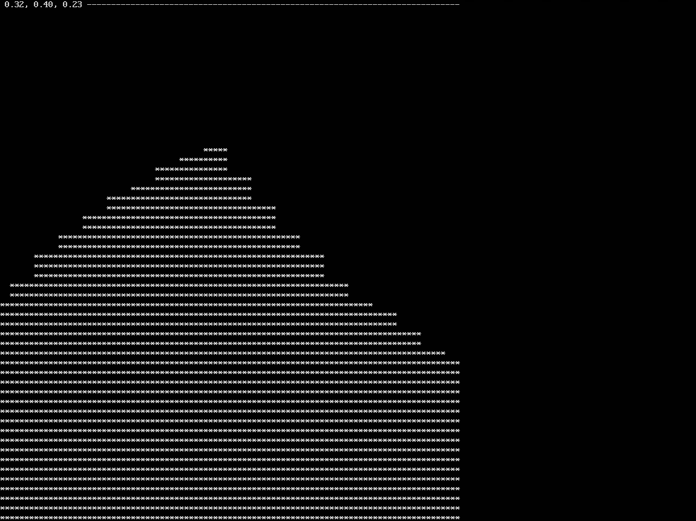

# Compte-Rendu TP 6 - Gestion des disques, Boot, Gestion des logs
 
&nbsp;

 ## Auteurs et date
 *Thomas GIRERD*
 
 *Guillaume RETUREAU*
 
*Date : 20.03.2020*

&nbsp;

***

&nbsp;

### Exercice 1.  Disques et partitions

**1. Dans l’interface de configuration de votre VM, créez un second disque dur, de 5 Go dynamiquement alloués ; puis démarrez la VM**


&nbsp;

**2. Vérifiez que ce nouveau disque dur est bien détecté par le système**


&nbsp;

**3. Partitionnez ce disque en utilisant fdisk : créez une première partition de 2 Go de type Linux (n°83), et une seconde partition de 3 Go en NTFS (n°7)**


&nbsp;

**4. A ce stade, les partitions ont été créées, mais elles n’ont pas été formatées avec leur système de fichiers. A l’aide de la commande mkfs, formatez vos deux partitions ( pensez à consulter le manuel !)**


&nbsp;

**5. Pourquoi la commande df -T, qui affiche le type de système de fichier des partitions, ne fonctionne-telle pas sur notre disque ?**


&nbsp;

**6. Faites en sorte que les deux partitions créées soient montées automatiquement au démarrage de la machine, respectivement dans les points de montage /data et /win (vous pourrez vous passer des UUID en raison de l’impossibilité d’effectuer des copier-coller)**


&nbsp;

**7. Utilisez la commande mount puis redémarrez votre VM pour valider la configuration**


&nbsp;


**8. Montez votre clé USB dans la VM**


&nbsp;


**9. Créez un dossier partagé entre votre VM et votre système hôte (rem. il peut être nécessaire d’installer les Additions invité de VirtualBox**


&nbsp;

***

### Exercice 2. Personnalisation de GRUB

**1. Commencez par changer l’extension du fichier /etc/default/grub.d/50-curtin-settings.cfg s’il est présent dans votre environnement (vous pouvez aussi commenter son contenu).**


&nbsp;


**2. Modifiez le fichier /etc/default/grub pour que le menu de GRUB s’affiche pendant 10 secondes ; passé ce délai, le premier OS du menu doit être lancé automatiquement.**


&nbsp;


**3. Lancez la commande update-grub**


&nbsp;


**4. Redémarrez votre VM pour valider que les changements ont bien été pris en compte**


&nbsp;


**5. On va augmenter la résolution de GRUB et de notre VM. Cherchez sur Internet le ou les paramètres à rajouter au fichier grub.**


&nbsp;


**6. On va à présent ajouter un fond d’écran. Il existe un paquet en proposant quelques uns : grub2-splash-images (après installation, celles-ci sont disponibles dans /usr/share/images/grub).**


&nbsp;


**7. Il est également possible de configurer des thèmes. On en trouve quelques uns dans les dépôts (grub2-themes-*). Installez-en un**


&nbsp;


**8. Ajoutez une entrée permettant d’arrêter la machine, et une autre permettant de la redémarrer.**


&nbsp;


**9. Configurer GRUB pour que le clavier soit en français**


&nbsp;

***
### Exercice 3. Noyau

**1. Commencez par installer le paquet build-essential, qui contient tous les outils nécessaires (compilateurs, bibliothèques) à la compilation de programmes en C (entre autres).**


&nbsp;


**2. Créez un fichier hello.c contenant le code suivant :**

```c
#include <linux/module.h>
#include <linux/kernel.h>

MODULE_LICENSE("GPL");
MODULE_AUTHOR("John Doe");
MODULE_DESCRIPTION("Module hello world");
MODULE_VERSION("Version 1.00");

int init_module(void)
{
printk(KERN_INFO "[Hello world] - La fonction init_module() est appelée.\n");
return 0;
}

void cleanup_module(void)
{
printk(KERN_INFO "[Hello world] - La fonction cleanup_module() est appelée.\n");
}
```

&nbsp;


**3. Créez également un fichier Makefile :**

```c
obj-m += hello.o

all:
make -C /lib/modules/$(shell uname -r)/build M=$(PWD) modules

clean:
make -C /lib/modules/$(shell uname -r)/build M=$(PWD) clean

install:
cp ./hello.ko /lib/modules/$(shell uname -r)/kernel/drivers/misc
```

&nbsp;


**4. Compilez le module à l’aide de la commande make, puis installez-le à l’aide de la commande make install**


&nbsp;


**5. Chargez le module ; vérifiez dans le journal du noyau que le message ”La fonction init_module() est appelée” a bien été inscrit, synonyme que le module a été chargé ; confirmez avec la commande lsmod.**


&nbsp;


**6. . Utilisez la commande modinfo pour obtenir des informations sur le module hello.ko ; vous devriez notamment voir les informations figurant dans le fichier C.**


&nbsp;


**7. Déchargez le module ; vérifiez dans le journal du noyau que le message ”La fonction cleanup_module() est appelée” a bien été inscrit, synonyme que le module a été déchargé ; confirmez avec la commande lsmod.**


&nbsp;


**8. Pour que le module soit chargé automatiquement au démarrage du système, il faut l’inscrire dans le fichier /etc/modules. Essayez, et vérifiez avec la commande lsmod après redémarrage de la machine.**


&nbsp;
***

### Exercice 4. Exécution de commandes en différé : at et cron

**1. Programmez une tâche qui affiche un rappel pour la réunion qui aura lieu dans 3 minutes. Vérifiez entre temps que la tâche est bien programmée.**

```
$ echo 'echo "Réunion !!!"' | at now +3 minutes
warning: commands will be executed using /bin/sh
job 1 at Fri Mar 20 15:42:00 2020

$ atq
1       Fri Mar 20 15:42:00 2020 a herysia
```

On vérifie bien que la commande sera éxecutée à 15h42, le même jour (donc 3 minutes plus tard)

&nbsp;


**2. Est-ce que le message s’est affiché ? Si la réponse est non, essayez de trouver la cause du problème (par exemple en vous aidant des logs, du manuel...)**

La tâche à expirée, mais rien n'a été affiché.
Dans le fichier `/etc/log/syslog`
nous avons la ligne `Mar 20 15:42:00 server atd[21580]: Exec failed for mail command: No such file or directory` qui est apparue à l'heure d'éxécution de la commande at.
On installe donc un serveur mail pour pouvoir gérer ces messages (car at envoie un email à l'utilisateur): `sudo apt install mailutils`, en local uniquement
Puis on réessaye:

On obtient le message `` dans la console, 3 minutes plus tard (lors de la prochaine entrée dans le terminal, dans le cas d'une connexion ssh). En le consultant on voit: 

```
From herysia@server  Fri Mar 20 16:18:00 2020
Return-Path: <herysia@server>
X-Original-To: herysia
Delivered-To: herysia@server
Received: by server (Postfix, from userid 1000)
        id 7F636121D99; Fri, 20 Mar 2020 16:18:00 +0100 (CET)
Subject: Output from your job       13
To: herysia@server
Message-Id: <20200320151800.7F636121D99@server>
Date: Fri, 20 Mar 2020 16:18:00 +0100 (CET)
From: herysia <herysia@server>

Réunion !!
```
La notification a donc bien fonctionné

On vide l'historique des mails pour la suite: `echo '' > /var/mail/herysia`

&nbsp;

**3. Pour tester le fonctionnement de cron, commencez par programmer l’exécution d’une tâche simple, l’affichage de “Il faut réviser pour l’examen !”, toutes les 3 minutes.**

On éxecute la commande: `crontab -e`
puis on choisit le mode 1 pour éditer avec nano et on ajoute la ligne:

`*/3 * * * * echo "echo \"Il faut réviter pour l'examen!\""`

On vérifie donc bien que l'on reçoit un mail toutes les 3 minutes, avec la notification.

```
$ cat /var/mail/herysia

From herysia@server  Fri Mar 20 16:36:01 2020
Return-Path: <herysia@server>
X-Original-To: herysia
Delivered-To: herysia@server
Received: by server (Postfix, from userid 1000)
        id 37673121D99; Fri, 20 Mar 2020 16:36:01 +0100 (CET)
From: root@server (Cron Daemon)
To: herysia@server
Subject: Cron <herysia@server> echo "echo \"Il faut réviter pour l'examen!\""`
MIME-Version: 1.0
Content-Type: text/plain; charset=UTF-8
Content-Transfer-Encoding: 8bit
X-Cron-Env: <SHELL=/bin/sh>
X-Cron-Env: <HOME=/home/herysia>
X-Cron-Env: <PATH=/usr/bin:/bin>
X-Cron-Env: <LOGNAME=herysia>
Message-Id: <20200320153601.37673121D99@server>
Date: Fri, 20 Mar 2020 16:36:01 +0100 (CET)

echo "Il faut réviter pour l'examen!"

From herysia@server  Fri Mar 20 16:39:01 2020
Return-Path: <herysia@server>
X-Original-To: herysia
Delivered-To: herysia@server
Received: by server (Postfix, from userid 1000)
        id 3C6BD121D99; Fri, 20 Mar 2020 16:39:01 +0100 (CET)
From: root@server (Cron Daemon)
To: herysia@server
Subject: Cron <herysia@server> echo "echo \"Il faut réviter pour l'examen!\""`
MIME-Version: 1.0
Content-Type: text/plain; charset=UTF-8
Content-Transfer-Encoding: 8bit
X-Cron-Env: <SHELL=/bin/sh>
X-Cron-Env: <HOME=/home/herysia>
X-Cron-Env: <PATH=/usr/bin:/bin>
X-Cron-Env: <LOGNAME=herysia>
Message-Id: <20200320153901.3C6BD121D99@server>
Date: Fri, 20 Mar 2020 16:39:01 +0100 (CET)

echo "Il faut réviter pour l'examen!"
```

On supprime la crontab pour éviter de recevoir des mails en permanence (et car on a bien révisé nos éxamens)

```
$ crontab -r
$ crontab -l
no crontab for herysia
```

&nbsp;


**4. Programmez l’exécution d’une commande tous les jours, toute l’année, tous les quarts d’heure**

- `crontab -e`
- On ajoute:  `*/15 * * * * echo "echo \"1/4 d'heure écoulé\""`

&nbsp;


**5. Programmez l’exécution d’une commande toutes les cinq minutes à partir de 2 (2, 7, 12, etc.) à 18 heures les 1er et 15 du mois :**

- `crontab -e`
- On ajoute:  `2-59/5 18 1,15 * * echo "echo \"Message question 5\""`

`2-59/5`: toutes les cinq minutes à partir de 2 (2, 7, 12, etc.)
`18`: à 18h uniquement (donc 18h02, 18h07, ...)
`1,15`: les 1er et 15 du mois

&nbsp;


**6. Programmez l’exécution d’une commande du lundi au vendredi à 17 heures**

- `crontab -e`
- On ajoute:  `0 17 * * 1-5 echo "echo \"Message question 6\""`

`1-5`: les jours 1 à 5 (lundi à vendredi)

&nbsp;


**7. Modifiez votre crontab pour que les messages ne soient plus envoyés par mail, mais redirigés dans un fichier de log situé dans votre dossier personnel**

Pour chaque tâche à écrire dans un fichier, ajouter à la fin:
`>> /home/herysia/crontab.log 2>&1`

On observe qu'il n'y a plus de mail, et le fichier crontab.log est créé et contient (avec uniquement la 1ère cron (examen))
```
cat crontab.log
echo "Il faut réviter pour l'examen!"
```

On note d'ailleurs que le double echo de la diapo n'est pas utile et aurais pu être omis.

&nbsp;


**8. Videz votre crontab**

```
$ crontab -r
$ crontab -l
no crontab for herysia
```


&nbsp;

***

### Exercice 5. Surveillance de l’activité du système

**1. Dans la console virtuelle tty1, lancez la commande htop, puis tapez la commande w dans tty2. Qu’affiche cette commande ?**

On éxecture `htop` sur le tty1, puis `w` sur tty2
On a pu vérifier les terminaux en utilisant la commande `tty`
```
$ tty
/dev/tty1
```
On change de terminal avec ctrl+alt+F1/F2
```
$ tty
/dev/tty2
```
On obtient:
```
$ w
17:48:00 up  1:01,  3 users,  load average: 0.07, 0.02, 0.00
USER     TTY      FROM             LOGIN@   IDLE   JCPU   PCPU WHAT
herysia  tty1     -                17:19    1:12   0.64s  0.58s htop
herysia  pts/0    192.168.137.1    17:13    1:17   0.05s  0.05s -bash
herysia  tty2     -                17:45    0.00s  0.15s  0.00s w
```


&nbsp;


**2. Comment afficher l’historique des dernières connexions à la machine ?**

```
$ last
USER     TTY      FROM             LOGIN@   IDLE   JCPU   PCPU WHAT
herysia  tty2                          Fri Mar 20 17:45   still logged in
herysia  pts/0        192.168.137.1    Fri Mar 20 17:19   still logged in
herysia  tty1                          Fri Mar 20 17:18   still logged in
```

&nbsp;


**3. Quelle commande permet d’obtenir la version du noyau ?**

```
$ uname -v
#88-Ubuntu SMP Tue Feb 11 20:11:34 UTC 2020
```

&nbsp;


**4. Comment récupérer toutes les informations sur le processeur, au format JSON ?**

On récupère les données dans le fichier `/proc/cpuinfo`
```
processor       : 0
vendor_id       : GenuineIntel
cpu family      : 6
model           : 60
model name      : Intel(R) Xeon(R) CPU E3-1240 v3 @ 3.40GHz
stepping        : 3
microcode       : 0xffffffff
cpu MHz         : 3392.150
cache size      : 8192 KB
physical id     : 0
siblings        : 1
core id         : 0
cpu cores       : 1
apicid          : 0
initial apicid  : 0
fpu             : yes
fpu_exception   : yes
cpuid level     : 13
wp              : yes
flags           : fpu vme de pse tsc msr pae mce cx8 apic sep mtrr pge mca cmov pat pse36 clflush mmx fxsr sse sse2 ss syscall nx lm constant_tsc rep_good nopl cpuid pni pclmulqdq ssse3 fma cx16 sse4_1 sse4_2 movbe popcnt aes xsave avx f16c rdrand hypervisor lahf_lm abm pti fsgsbase bmi1 avx2 smep bmi2 erms xsaveopt
bugs            : cpu_meltdown spectre_v1 spectre_v2 spec_store_bypass l1tf mds swapgs itlb_multihit
bogomips        : 6784.30
clflush size    : 64
cache_alignment : 64
address sizes   : 39 bits physical, 48 bits virtual
power management:
```

Pour le formater en json, il faut réaliser un script, étant plus à l'aise en javascript, et JSON étant particulièrement bien adapté au javascript, c'est ce que je vais utiliser

`/home/herysia/procinfo.js`
```js
const fs = require('fs');
const procInfo = fs.readFileSync('/proc/cpuinfo').toString();
let out = {}
for(const line of procInfo.split(/\n/g)){
    let data = line.split(':');
    if(data.length === 2) {
        let key = data[0].trim();
        let value = data[1].trim();
        out[key] = value;
    }
}
console.log(JSON.stringify(out, null, '\t'));
```
On obtient:
```json
$ node procinfo.js
{
        "processor": "0",
        "vendor_id": "GenuineIntel",
        "cpu family": "6",
        "model": "60",
        "model name": "Intel(R) Xeon(R) CPU E3-1240 v3 @ 3.40GHz",
        "stepping": "3",
        "microcode": "0xffffffff",
        "cpu MHz": "3392.150",
        "cache size": "8192 KB",
        "physical id": "0",
        "siblings": "1",
        "core id": "0",
        "cpu cores": "1",
        "apicid": "0",
        "initial apicid": "0",
        "fpu": "yes",
        "fpu_exception": "yes",
        "cpuid level": "13",
        "wp": "yes",
        "flags": "fpu vme de pse tsc msr pae mce cx8 apic sep mtrr pge mca cmov pat pse36 clflush mmx fxsr sse sse2 ss syscall nx lm constant_tsc rep_good nopl cpuid pni pclmulqdq ssse3 fma cx16 sse4_1 sse4_2 movbe popcnt aes xsave avx f16c rdrand hypervisor lahf_lm abm pti fsgsbase bmi1 avx2 smep bmi2 erms xsaveopt",
        "bugs": "cpu_meltdown spectre_v1 spectre_v2 spec_store_bypass l1tf mds swapgs itlb_multihit",
        "bogomips": "6784.30",
        "clflush size": "64",
        "cache_alignment": "64",
        "address sizes": "39 bits physical, 48 bits virtual",
        "power management": ""
}
```
On obtient un beau json tout beau, bien formaté !

&nbsp;


**5. Comment obtenir la liste des derniers démarrages de la machine avec la commande journalctl ?**
**Comment afficher tout ce qu’il s’est passé sur la machine lors de l’avant-dernier boot ?**

```
$ journalctl --list-boots
-2 d7156cd4fea94047b0d5a49273fded69 Fri 2020-02-28 13:39:15 CET—Fri 2020-02-28 15:31:43 CET
-1 fc90a023595d4b28b0bcdbec046fdff5 Fri 2020-02-28 15:31:52 CET—Fri 2020-03-20 16:46:05 CET
 0 3a66e63317754ea1a1fbe48cb98cd98b Fri 2020-03-20 16:46:16 CET—Fri 2020-03-20 18:30:12 CET
```

&nbsp;


**6. Comment obtenir la liste des derniers démarrages de la machine avec la commande journalctl ?**

On utilise `journalctl -b -2`

&nbsp;


**7. Faites en sortes que lors d’une connexion à la machine, les utilisateurs soient prévenus par un message à l’écran d’une maintenance le 26 mars à minuit.**

On modifie le motd (message of the day avec: `sudo nano /etc/motd`
Et on y ajoute notre message `Attention ! Maintenance prévue le 26 mars à minuit.`

On obtient à la connexion:
```
...
20 updates are security updates.


Attention ! Maintenance prévue le 26 mars à minuit.
You have mail.
Last login: Fri Mar 20 18:17:11 2020 from 192.168.137.1
herysia@server:~$
```

&nbsp;


**8. Ecrivez un script bash qui permet de calculer le k-ième nombre de Fibonacci : Fk = Fk−1 + Fk−2, avec F0 = F1 = 1. Lancez le calcul de F100 puis lancez la commande tload depuis un autre terminal virtuel. Que constatez-vous ? Interrompez ensuite le calcul avec CTRL+C et observez la conséquence sur l’affichage de tload.**

On écrit le script fibonacci
```
#!/bin/bash

F0=1
F1=1
k=$1

for (( i=0; i<k; i++))
do
        Fn=$((F0+F1))
        F0=$F1
        F1=$Fn
done
echo "$k i-ème terme de Fibonacci: $F0"
```
On le rends éxecutable et l'éxecute:
```
$ chmod u+x fibonacci
./fibonacci 100
```
On note que la valeur est incorrecte, en effet on dépasse la taille maximale d'un entier 64 bit, qui est atteinte à k=92
```
$ ./fibonacci 100
100 i-ème terme de Fibonacci: 1298777728820984005
$ ./fibonacci 91
91 i-ème terme de Fibonacci: 7540113804746346429
$ ./fibonacci 92
92 i-ème terme de Fibonacci: -6246583658587674878
```
Pour observer le résultat attendu, on calcule la suite de fibonnacci de 100 000 000.

On observe la courbe d'utilisation des ressources, la rupture correspondant à l'interruption du script:



&nbsp;


***

### Exercice 6. Interception de signaux

**1. Commencez par écrire un script qui recopie dans un fichier tmp.txt chaque ligne saisie au clavier par l’utilisateur**


&nbsp;


**2. Lancez votre script et appuyez sur CTRL+Z. Que se passe-t-il ? Comment faire pour que le script poursuive son exécution ?**


&nbsp;


**3. Toujours pendant l’exécution du script, appuyez sur CTRL+C. Que se passe-t-il ?**


&nbsp;


**4. Modifiez votre script pour redéfinir les actions à effectuer quand le script reçoit les signaux SIGTSTP (= CTRL+Z) et SIGINT (= CTRL+C) : dans le premier cas, il doit afficher ”Impossible de me placer en arrière-plan”, et dans le second cas, il doit afficher ”OK, je fais un peu de ménage avant” avant de supprimer le fichier temporaire et terminer le script.**


&nbsp;


**5. Testez le nouveau comportement de votre script en utilisant d’une part les raccourcis clavier, d’autre part la commande kill**


&nbsp;


**6. Relancez votre script et faites immédiatement un CTRL+C : vous obtenez un message d’erreur vous indiquant que le fichier tmp.txt n’existe pas. A l’aide de la commande interne test, corrigez votre script pour que ce message n’apparaisse plus.**


&nbsp;
***

### Exercice 7. Sauvegardes, `tar`

**1. Placez-vous dans votre dossier personnel, puis créez deux archives de ce dossier : une archive1.tar en indiquant * comme argument, et une archive2.tar en indiquant . comme argument. Comparez les deux archives. Que constatez-vous ? Expliquez.**


&nbsp;


**2. Quel est le problème avec la commande tar cvf archive.tar \* .\* ?**


&nbsp;


**3. Créez un dossier test contenant trois fichier tata, toto et tutu puis retirez les droits d’exécution sur ce dossier. Créez une archive de ce dossier. Que constatez-vous ? Expliquez.**


&nbsp;